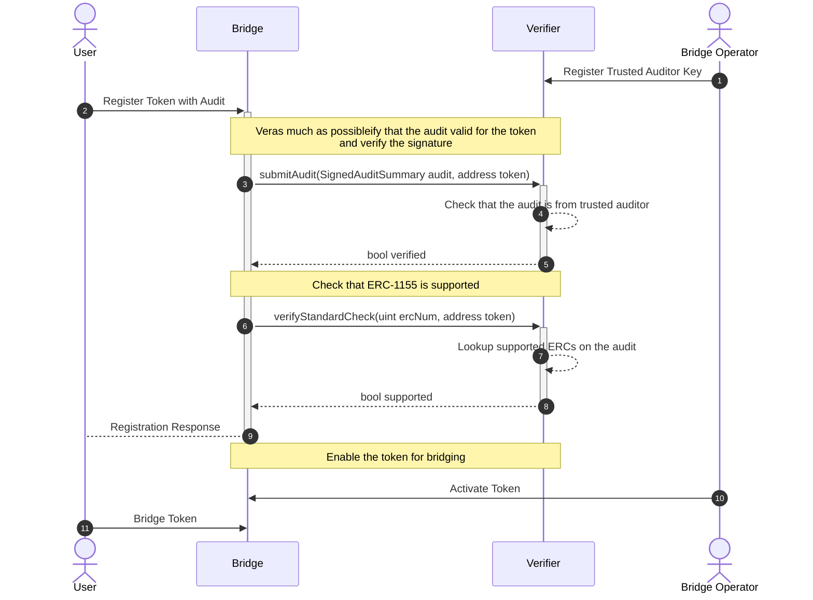

Imagine a hypothetical [ERC-1155](https://eips.ethereum.org/EIPS/eip-1155) token bridge. The goal is to create a scalable system where it is possible to easily register new tokens that can be bridged. To minimize the risk of malicious or faulty tokens being registered, audits will be used and verified onchain.

For showing the details of the flow more clearly, the diagram separates the Bridge and the Verifier. Theoretically both can live in the same contract. 

There are four parties:

- User: The end user that wants to bridge their token
- Bridge Operator: The operator is maintaining the bridge
- Bridge: The contract the user will interact with to trigger the bridging
- Validator: The contract that validates that a token can be bridged

As a first (1) step the bridge operator should define the keys/accounts for the auditors from which audits are accepted for the token registration process. 

With this the user (or token owner) can trigger the registration flow (2). There are two steps (3 and 6) that will be performed: verify that the provided audit is valid and has been signed by a trusted auditor (4) and check that the token contract implements [ERC-1155](https://eips.ethereum.org/EIPS/eip-1155) (7).

With the checks being done it is still recommended to have some manual check in place by the operator to activate a token for bridging (10). This step could be omitted if there is a strong trust in the auditor or if an ERC provides strong compatibility guarantees. 

Once the token is available on the bridge the users can start using it (11). 